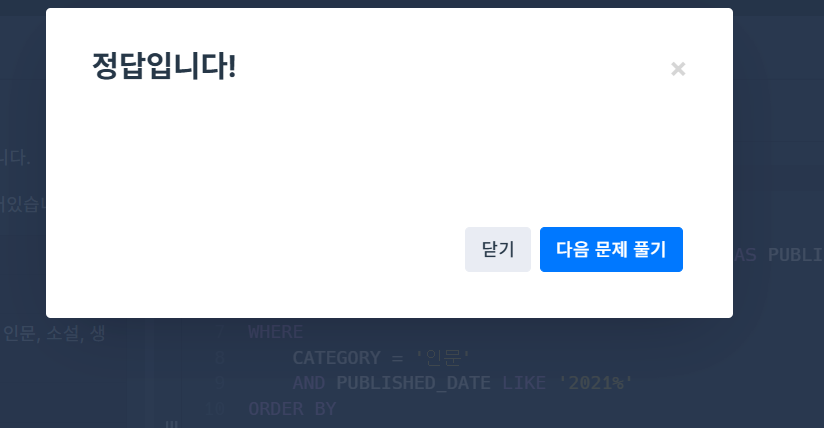

# SQL_BASIC 4주차 정규 과제 

📌SQL_BASIC 정규과제는 매주 정해진 분량의 `초보자를 위한 BigQuery(SQL) 입문` 강의를 듣고 간단한 문제를 풀면서 학습하는 것입니다. 이번주는 아래의 **SQL_Basic_4th_TIL**에 나열된 분량을 수강하고 `학습 목표`에 맞게 공부하시면 됩니다.

**4주차 과제부터는 강의 내용을 정리하는 것과 함께, 프로그래머스에서 제공하는 SQL 문제를 직접 풀어보는 실습도 병행합니다.** 강의에서는 **배운 내용을 정리하고 주요 쿼리 예제를 정리**하며, 프로그래머스 문제는 **직접 풀어본 뒤 풀이 과정과 결과, 배운 점을 함께 기록**해주세요. 완성된 과제는 Github에 업로드하고, 링크를 스프레드시트 'SQL' 시트에 입력해 제출해주세요.

**👀(수행 인증샷은 필수입니다.)** 

## SQL_BASIC_4th

### 섹션 4. 쿼리 잘 작성하기, 쿼리 작성 템플릿 및 오류를 잘 디버깅하기

### 3-4. 오류를 잘 디버깅하는 방법


## 섹션 5. 데이터 탐색 - 변환

### 4-1. INTRO

### 4-2. 데이터 타입과 데이터 변환(CAST, SAFE_CAST)

### 4-3. 문자열 함수(CONCAT, SPLIT, REPLACE, TRIM, UPPER)

### 4-4. 날짜 및 시간 데이터 이해하기(1) (타임존, UTC, Millisecond, TIMESTAMP/DATETIME)


## 🏁 강의 수강 (Study Schedule)

| 주차  | 공부 범위              | 완료 여부 |
| ----- | ---------------------- | --------- |
| 1주차 | 섹션 **1-1** ~ **2-2** | ✅         |
| 2주차 | 섹션 **2-3** ~ **2-5** | ✅         |
| 3주차 | 섹션 **2-6** ~ **3-3** | ✅         |
| 4주차 | 섹션 **3-4** ~ **4-4** | ✅         |
| 5주차 | 섹션 **4-4** ~ **4-9** | 🍽️         |
| 6주차 | 섹션 **5-1** ~ **5-7** | 🍽️         |
| 7주차 | 섹션 **6-1** ~ **6-6** | 🍽️         |

<br>

<!-- 여기까진 그대로 둬 주세요-->

---

# 1️⃣ 개념정리

## 3-4. 오류를 디버깅하는 방법

~~~
✅ 학습 목표 :
* 오류의 정의에 대해 설명할 수 있다. 
* 오류 메시지를 보고 디버깅이라는 과정을 수행할 수 있다. 
~~~

<!-- 새롭게 배운 내용을 자유롭게 정리해주세요.-->
### 오류의 정의 (Error)

- '방황하다, 길을 잃다'라는 뜻의 라틴어에서 유해한 단어
- 부정확하거나 잘못된 행동을 의미
- 실수와 동의어인 경우도 있음

### 오류 메세지가 알려주고자 하는 것

- 현재 작성한 방식으로 하면 답을 얻을 수 없다 (길잡이 역할)
- 이 부분이 문제가 있다 (문제 진단)

### 오류를 바라보는 관점

- 오류가 발생하면? -> 길잡이가 나를 더 좋은 길로 나아가게 하는구나
- 좋은 길로 가는 법 -> **오류 메세지**를 보면서 진행하는 것!

### 대표적인 오류 카테고리

- 1.Syntax Error (SELECT list must not be empty at [3:1])
-> 문법을 지키지 않아 생기는 오류
- Error 메세지를 보고 번역 또는 해석한 후, 해결 방법 찾아보기
-> 구글에 검색, AI에게 질문, 지인에게 질문 등
 
~~~
1 SELECT
2
3 FROM
4 WHERE

Syntax Error : SELECT list must not be empty at [3:1]
# 오류 메세지 번역 : SELECT 목록은 [3:1]에서 비어있으면 안됩니다

SELECT
col => 이 부분이 비어있기에 생기는 오류
FROM
~~~

- 2.Number of arguments does not match for aggregate function COUNT

~~~
SELECT
 COUNT(id, kor_name)
FROM basic.pokemon

# 해석 : 집계 함수 COUNT의 인자 수가 일치하지 않습니다.

COUNT(kor_name, eng_name) => X (count 안에는 인자가 하나밖에 들어갈 수 없음)
~~~

- 3.SELECT list awpression references column type1 a which is neither grouped nor aggregated

~~~
SELECT
 type1,
 COUNT(id) AS cnt
FROM basic.pokemon

# 해석 : SELECT 목록 식은 다음에서 그룹화되거나 집계되지 않은 열을 참조합니다.

=> GROUP BY에 적절한 컬럼을 명시하지 않았을 경우 발생하는 오류
~~~

- 4.Syntax Error : Expected end of input but got keyword SELECT

~~~
SELECT
 type1,
 COUNT(id) AS cnt
FROM basic.pokemon
GROUP BY
 type1

SELECT
*
FROM basic.pokemon

# 해석 : 입력이 끝날 것으로 예상되었지만 SELECT 키워드가 입력되었습니다.

- SELECT 근처 확인하기
- 하나의 쿼리엔 SELECT가 1개만 있어야 함
- 혹은 쿼리가 끝나는 부분에 ; 붙이고 실팽할 부분만 드래그 앤 드랍해서 실행하기
~~~

- 5.Syntax error : Expected end of input but got keyword WHERE at [4:1]

~~~
1 SELECT
2 *
3 FROM basic.trainer LIMIT 10
4 WHERE
5 id =3

# 해석 : 입력이 끝날 것으로 예상되었지만 [4:1]에서 키워드 WHERE을 얻었다.

=> LIMIT은 항상 구문 마지막에 있어야 함. LIMIT 뒤에 WHERE이 와서 발생한 오류.
~~~

- 6.Syntax Error : Expected ")" but got end of script at [8:11]

~~~
1 SELECT
2 name,
3 FROM (
4   SELECT
5     *
6   FROM basic.trainer
7   WHERE
8   id =3

# 해석 : ")"가 예상되지만 [8:11]에 스크립트가 끝났습니다.

=> 괄호를 작성하지 않은 경우. 괄호를 완성시켜주어야 함
~~~


## 4-2. 데이터 타입과 데이터 변환(CAST, SAFE_CAST)

~~~
✅ 학습 목표 :
* 데이터 타입의 종류를 설명할 수 있다. 
* 데이터 타입을 변환하는 방법을 설명할 수 있다. 
~~~

<!-- 새롭게 배운 내용을 자유롭게 정리해주세요.-->
### 데이터 타입
- 숫자(정수), 문자(따옴표), 시간&날짜(Date), 부울(Bool, 참이나 거짓) ...

### 데이터 타입이 중요한 이유

- 보이는 것과 저장된 것의 차이가 존재

  -> 엑셀에서 보면 빈 값 => NULL or "", 1 => 숫자 1 or 문자 1

  -> 내 생각과 다른 경우 데이터의 타입을 서로 변경해야 함.

### 자료 타입 변경하기 (CAST)

```sql
SELECT
 CAST(1 AS STRING) # 숫자 1을 문자 1로 변경
 ```

- 더 안전하게 데이터 타입 변경하기 : SAFE_CAST
- SAFE_ 가 붙은 함수는 변환이 실패할 경우 **NULL** 반환

```sql
SELECT
 SAFE_CAST("SW" AS INT64)

# 결과값 : NULL
```


## 4-3. 문자열 함수(CONCAT, SPLIT, REPLACE, TRIM, UPPER)

~~~
✅ 학습 목표 :
* 문자열 함수들의 종류를 이해하고 어떠한 상황에서 사용하는지 설명할 수 있다. 
~~~

<!-- 새롭게 배운 내용을 자유롭게 정리해주세요.-->

- 문자열이란 ? ""로 묶인 것들. 
- 문자열 데이터로 할 수 있는 대표적인 연산

(붙이기, 분리하기, 수정하기, 자르기, 대문자 변환)

### 문자열 붙이기 (CONCAT)
```SQL
SELECT
 CONCAT("안녕", "하세요") AS result

# FROM이 없어도 CONCAT은 직접 인자로 넣어줘서 실행 가능
# result => 안녕하세요
```

### 문자열 분리하기 (SPLIT)
```SQL
SELECT
 SPLIT("가, 나, 다", ", ") AS result

# SPLIT(문자열_원본, 나눌 기준이 되는 문자)
# RESULT => 가, 나, 다
```

### 특정 단어 수정하기 (REPLACE)
```SQL
SELECT
 REPLACE("안녕", "바보", "천재") AS result

# REPLACE(문자열 원본, 찾을 단어, 바꿀 단어)
```
### 문자열 자르기 (TRIM)
```SQL
SELECT
 TRIM("안녕하세요", "하세요") AS result

# TRIM(문자열 원본, 자를 단어)
# result => 안녕
```

### 영어 소문자를 대문자로 변경 (UPPER)
```SQL
SELECT
 UPPER("abc") AS result

# result => ABC
```

### 정리

| 연산 | Input | Output | 함수이름 |
| --- | --- | --- | --- |
| 문자열 붙이기 | "안녕"+"하세요" | "안녕하세요" | CONCAT |
| 문자열 분리하기 | "가,나,다,라" | "가", "나", "다", "라" | SPLIT |
| 특정 단어 수정하기 |"안녕하세요" | "실천하세요" | REPLACE |
| 문자열 자르기 | "안녕하세요" | "안녕" | TRIM |
| 영어 대문자 변환 | "abc" | "ABC" | UPPER |


## 4-4. 날짜 및 시간 데이터 이해하기(1) (타임존, UTC, Millisecond, TIMESTAMP/DATETIME)

~~~
✅ 학습 목표 :
* 날짜 및 시간 데이터 타입과 UTC의 개념을 설명할 수 있다. 
* DATE, DATETIME, TIMESTAMP 에 대해서 설명할 수 있다.
* 시간함수들의 종류와 시간의 차이를 추출하는 방법을 설명할 수 있다. 
~~~

<!-- 새롭게 배운 내용을 자유롭게 정리해주세요.-->

### 날짜 및 시간 데이터의 핵심

1. 날짜 및 시간 데이터 타입 파악하기 : DATE, DATETIME, TIMESTAMP
2. 날짜 및 시간 데이터 관련 알면 좋은 내용 : UTC, Millisecond
3. 날짜 및 시간 데이터 타입 변환하기
4. 시간 함수 (두 시간의 차이, 특정 부분 추출하기)

### 시간 데이터

- DATE : DATE만 표시 (2026-03-29)
- DATETIME : DATE와 TIME까지 표시, TIMEZONE 정보 없음 (2026-03-29 14:00:00)
- TIME : TIME만 표시 (14:00:00)
- 타임존 : GMT(그리니치 천문대 기준), UTC(국제적인 표준 시간)
- TIMESTAMP : 시간 도장 (UTC부터 경과한 시간을 나타내는 값 - 타임존 정보 있음)
- millisecond(ms) : 천분의 1초

### 시간 데이터끼리의 변환
- timestamp와 datetime

|  | TIMESTAMP | DATETIME |
| --- | --- | --- |
| 타임존 | UTC라고 나옴 | T가 나옴(TIME을 의미) |
| 시간 차이 | 한국 -9시간 | 한국 ZONE 사용시 한국 시간과 동일 |

<br>

<br>

---

# 2️⃣ 확인문제 & 문제 인증

## 프로그래머스 문제 

> 조건에 맞는 도서 리스트 출력하기
>
> **먼저 문제를 풀고 난 이후에 확인 문제를 확인해주세요**
>
> 문제 링크 
>
> :  https://school.programmers.co.kr/learn/courses/30/lessons/144853

<!-- 문제를 풀기 위하여 로그인이  필요합니다. -->




## 문제 1

> **🧚Q. 프로그래머스 문제를 풀던 규서는 여러 번의 시행착오 끝에 결국 혼자 해결하기 어려워 오류 메시지를 공유하며 도움을 요청했습니다. 여러분들이 오류 메시지를 확인하고, 해당 SQL 쿼리에서 어떤 부분이 잘못되었는지 오류 메시지를 해석하고 찾아 설명해주세요.**

~~~sql
# 조건에 맞는 도서 리스트 출력하기
# 규서의 SQL 첫 번째 풀이
SELECT BOOK_ID, PUBLISHED_DATE
FROM BOOK
WHERE CATEGORY = '인문'
  AND YEAR(PUBLISHED_DATE, 2021);
  
오류 메시지 : Error: Number of arguments does not match for function YEAR
~~~


~~~
YEAR 함수의 인수가 원래는 1개인데 규서는 2개를 넣었음.

원래는 YEAR(PUBLISHED_DATE, 2021)가 아니라
YEAR(PUBLISHED_DATE) = 2021 이게 맞음.
~~~


### 🎉 수고하셨습니다.
