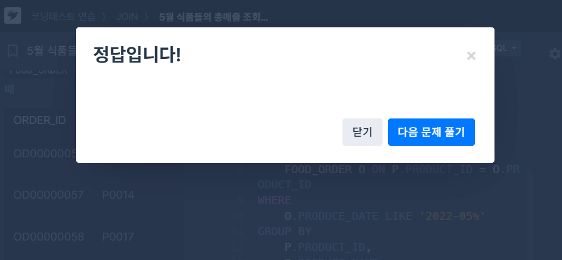
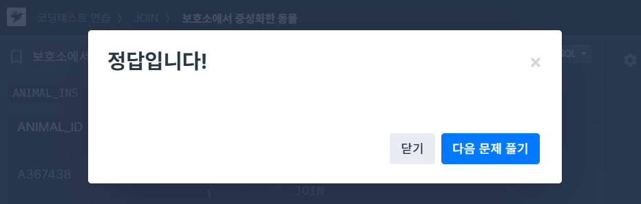
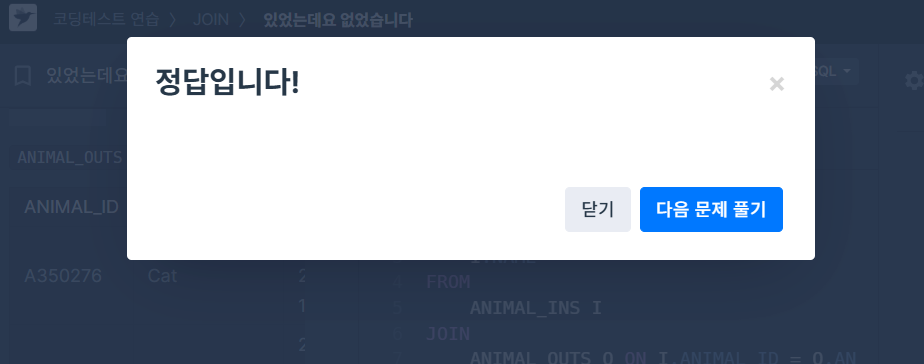
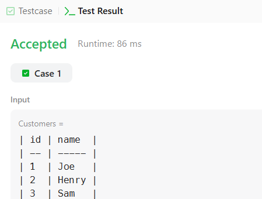
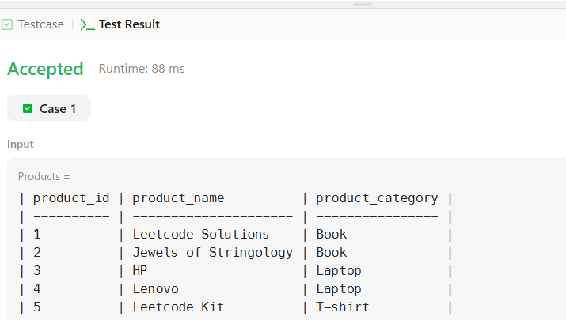

# SQL_BASIC 7주차 정규 과제 

📌SQL_BASIC 정규과제는 매주 정해진 분량의 `초보자를 위한 BigQuery(SQL) 입문` 강의를 듣고 간단한 문제를 풀면서 학습하는 것입니다. 이번주는 아래의 **SQL_Basic_7th_TIL**에 나열된 분량을 수강하고 `학습 목표`에 맞게 공부하시면 됩니다.

**7주차 과제는 강의 내용을 정리하는 것과 함께, 프로그래머스에서 제공하는 SQL 문제를 직접 풀어보는 실습도 병행합니다.** 강의에서는 **배운 내용을 정리하고 주요 쿼리 예제를 정리**하며, 프로그래머스 문제는 **직접 풀어본 뒤 풀이 과정과 결과, 배운 점을 함께 기록**해주세요. 완성된 과제는 Github에 업로드하고, 링크를 스프레드시트 'SQL' 시트에 입력해 제출해주세요.

**👀(수행 인증샷은 필수입니다.)** 

## SQL_BASIC_7th

### 섹션 7 데이터 결과 검증, 가독성 있는 쿼리 작성하기

### 6-1. Intro

### 6-2. 가독성을 챙기기 위한 SQL 스타일 가이드

### 6-3. 가독성을 챙기기 위한 WITH 문 & 파티션

### 6-4. 데이터 결과 검증 정의

### 6-5. 데이터 결과 검증 예시

### 6-6. 정리 


## 🏁 강의 수강 (Study Schedule)

| 주차  | 공부 범위              | 완료 여부 |
| ----- | ---------------------- | --------- |
| 1주차 | 섹션 **1-1** ~ **2-2** | ✅         |
| 2주차 | 섹션 **2-3** ~ **2-5** | ✅         |
| 3주차 | 섹션 **2-6** ~ **3-3** | ✅         |
| 4주차 | 섹션 **3-4** ~ **4-4** | ✅         |
| 5주차 | 섹션 **4-4** ~ **4-9** | ✅         |
| 6주차 | 섹션 **5-1** ~ **5-7** | ✅         |
| 7주차 | 섹션 **6-1** ~ **6-6** | ✅         |

<br>

<!-- 여기까진 그대로 둬 주세요-->

---

# 1️⃣ 개념정리

## 6-2. 가독성을 챙기기 위한 SQL 스타일 가이드

~~~
✅ 학습 목표 :
* 데이터 결과 검증하기 전에 실수가 발생하는 원인을 설명할 수 있다.
* SQL 쿼리를 가독성 있게 작성할 수 있다. 
~~~

<!-- 새롭게 배운 내용을 자유롭게 정리해주세요.-->
### 데이터 결과 검증 전

실수가 언제 발생하는가?
- 문법을 잘못 알고 있는 경우
- 데이터를 파악하지 않고 쿼리를 작성하는 경우
- 쿼리가 복잡한 경우

다른 사람의 쿼리를 봐야하는 경우 또는 내 쿼리를 다른 사람이 보는 경우
- 쿼리를 가독성 있게 작성해야함.
- 별도의 설명 없이 다른 사람들도 이해 가능.
- 수정할 때도 특정 부분만 쉽게 수정 및 파악 가능

### 스타일 가이드

#### 1. 예약어는 대문자로 작성
SQL에서 문법 적인 용도로 사용하고 있는 문자들은 대문자로 작성
예시 : SELECT, FROM, WHERE...

```sql
SELECT
 col
FROM table
WHERE
```

#### 2. 컬럼 이름은 snake_case로 작성
컬럼 이름은 CamelCase가 아닌 snake_case로 작성 (일관성이 중요)

```sql
SELECT
 col1 AS event_status
FROM table
```

#### 3. 명시적 vs 암시적인 이름
Alias로 별칭을 지을 때는 명시적인 이름을 적용

AS a, AS b 등 컬럼의 의미를 한번 더 생각하게 하는 이름이 아닌 명시적인 것을 사용

JOIN할 때 테이블의 이름도 명시적으로 할 수 있다면 명시적으로 진행하기

AS를 생략해서 별칭을 설정할 수도 있는데, AS를 쓰는 것도 명시적인 표현

#### 4. 왼쪽 정렬
기본적으로 왼쪽 정렬을 기준으로 작성

```sql
SELECT
 col
FROM table
WHERE 1=1

# Not good
SELECT col
 FROM table
WHERE 1=1
```

#### 5. 예약어나 컬럼은 한 줄에 하나씩 권장
컬럼은 바로 주석처리할 수 있는 장점이 있기에 한 줄에 하나씩 작성

```sql
SELECT
 col1,
 col2,
 col3
FROM table
WHERE
```

#### 6. 쉼표는 컬럼 바로 뒤에

```sql
SELECT
 col1,
 col2,
 col3
FROM table
```


## 6-3. 가독성을 챙기기 위한 WITH문 & 파티션

~~~
✅ 학습 목표 :
* SQL 쿼리를 가독성 있게 작성할 수 있다. 
* WITH문과 파티션을 활용해서도 가독성을 챙길 수 있다. 
~~~

<!-- 새롭게 배운 내용을 자유롭게 정리해주세요.-->

### WITH 구문
SQL 쿼리를 작성하다 생기는 일 -> 점점 복잡해짐 (가독성 하락)
만약 아래 쿼리가 다른 곳에서도 필요하면 복사 붙여넣기

```sql
SELECT
 col, col2
FROM (
    SELECT
     col, col2, col3 ...
    FROM
     Table
)
```

`WITH 구문`을 사용해 쿼리를 정의해서 재사용 가능

```sql
WITH temp_table AS (
    SELECT
     col, col2, col3 ...
    FROM
     table
)

SELECT
 col,col2
FROM temp_table
```

- CTE (Common Table Expression)라고 표현
- SELECT 구문에 이름을 정해주는 것과 유사
- 쿼리 내에서 반복적으로 사용할 수 있음

### 사용 방법

```sql
WITH name_a AS (
    SELECT
     col, col2, col3 ...
    FROM
     table
), name_b AS (
    SELECT
     col, col2, col3 ...
    FROM
     table2
)

SELECT
 col,col2
FROM name_a
```

### PARTITION
Table에서 Partition이라는 것 존재

창고에 수많은 물건이 매일 들어올 때 특정 시기 물건 찾는 방법
-> 애초에 일자별로 정리하면 됨.

#### PARTITION을 사용하면 좋은 점

1) 쿼리 성능 향상
- 전체 데이터를 스캔하는 것보다 파티션을 설정한 곳만 스캔하는 것이 더 빠름

2) 데이터 관리 용이성
- 특정 일자의 데이터를 모두 변경하거나 삭제해야 하면 파티션을 설정해서 삭제할 수 있음

3) 비용
- 파티션에 해당되는 데이터만 스캔해서 비용을 줄일 수 있음


## 6-4. 데이터 결과 검증 정의 

~~~
✅ 학습 목표 :
* 데이터 결과 검증이 어떤 과정인지 설명할 수 있다. 
* 데이터 결과 검증에 대한 예시를 이해할 수 있다.  
~~~

<!-- 새롭게 배운 내용을 자유롭게 정리해주세요.-->

### 데이터 결과 검증의 정의

SQL 쿼리 후 얻은 결과가 예상과 일치하는지 확인하는 과정

- 목적 : 분석 결과의 정확성, 신뢰성 확보

방법은 심플
- 내가 기대하는 예상 결과를 정의
- 쿼리 작성
- 두개가 일치하는지 비교

제일 중요한 부분
- 문제를 잘 정의하고, 미리 작성해보기
- 도메인 특수성(이런 규칙 등) 잘 파악하기
- SQL 쿼리 템플릿과 맥락이 유사

### 데이터 결과를 검증하는 흐름

```
1) 문제 정의 확인 - 구체적인 문제 정의. 요청 사항도 구체적으로 확인
2) Input, Output - 데이터의 Input과 Output(원하는 형태) 작성하기
                 - Input-중간결과-Output 에서 중간결과 생략하기

3) 쿼리 작성 - 가독성 챙기기
4) 결과 비교 - 예상과 실제 쿼리 결과의 차이가 있는지 확인 
    4-1) 차이가 있다면 - 쿼리 재작성
    4-2) 차이가 없다면 - 결과 검증 끝
```

### 데이터 결과 검증할 때 자주 활용하는 SQL 쿼리
대표적으로 활용하는 SQL 문법

1) COUNT(*) : 행 수를 확인. 의도한 데이터의 행 개수가 맞는가?
2) NOT NULL : 특정 컬럼에 NULL이 존재하는가? 필수 필드가 비어있지 않는가?
3) DISTINCT : 데이터의 고유값을 확인해 중복 여부 확인
4) IF문, CASE WHEN : 의도와 같다면 TRUE, 아니면 FALSE

1+3) COUNT(DISTINCT col), COUNT(col) 두 컬럼을 보고 개수를 비교

### 실무자 방식

```
1) 특정 user_id로 필터링을 걸어서 확인
- 1명의 데이터 확인
- 결과를 예상할 때 Raw data 에서 하나씩 세고 적어둠(예상결과)
- 1명의 데이터의 예상 결과와 쿼리 결과가 동일한지 확인
- 다른 user_id 3~4건 더 추가해서 확인 
- 동일한 결과가 나오면 user_id 조건 삭제
```
```
2) 샘플 데이터 생성하기
- WITH 문을 사용해 예시 데이터를 생성한 후, 결과를 예상하고 쿼리 작성
- 복잡한 데이터에서 하기 전에, 쿼리 자체가 올바른지 확인할 때 주로 사용
```


<br>

<br>

---

# 2️⃣ 확인문제 & 문제 인증

## 프로그래머스 문제 

https://school.programmers.co.kr/learn/courses/30/lessons/131117

> 5월 식품들의 총매출 조회하기

https://school.programmers.co.kr/learn/courses/30/lessons/59045

> 보호소에서 중성화한 동물

https://school.programmers.co.kr/learn/courses/30/lessons/59043

> 있었는데요 없었습니다.


## LeetCode 문제

https://leetcode.com/problems/customers-who-never-order/

> 183. Customers Who Never Order

https://leetcode.com/problems/list-the-products-ordered-in-a-period/

> 585. Investments in 2016









## 문제 1

> **🧚예운이는 다음 SQL 쿼리를 다트비 정규과제에 제출했다. 제출한 쿼리는 다음과 같고, 이 쿼리는 에러 메시지 없이 잘 수행하는 쿼리이다.**

~~~sql
# 예운이가 작성한 가독성 나쁜 SQL 

select u.name , o.OrderID
, p.ProductName ,od.Quantity ,od.UnitPrice 	from Users u	join Orders o on u.id = o.userId
join OrderDetails od on o.OrderID = od.orderID	join Products p on od.ProductID = p.ProductID
where u.region= 'Busan'			order by o.OrderID
~~~

> **이에 과제를 검사하던 진아는 작성한 SQL을 보고 코드 리뷰를 진행하려고 했지만, 다음 쿼리를 보고 예운이에게 질문을 하였다. "예운아, 이 쿼리 가독성이 좀 안 좋은데 내가 고쳐도 괜찮을까? 가독성 좋게 SQL 가이드에 따라 정리해보려고 해"**
>
> 다음 SQL 쿼리를 **가독성 좋은 스타일로 다시 작성해보세요.** 


~~~sql
SELECT 
    u.name, 
    o.OrderID, 
    p.ProductName, 
    od.Quantity, 
    od.UnitPrice  
FROM Users u  
JOIN Orders o ON u.id = o.userId
JOIN OrderDetails od ON o.OrderID = od.orderID  
JOIN Products p ON od.ProductID = p.ProductID
WHERE 
    u.region = 'Busan'        
ORDER BY 
    o.OrderID
~~~

---

한 학기 동안 다소 부족한 커리큘럼이었음에도 불구하고 성실하게, 그리고 열심히 과제를 수행해주셔서 진심으로 감사드립니다.

이번 과정을 통해 배운 내용이 앞으로 여러분이 SQL을 다루는 데에 조금이나마 도움이 되기를 바랍니다.

여러분의 앞날을 진심으로 응원합니다. 😊

<br>

<br>

### 🎉 수고하셨습니다.
